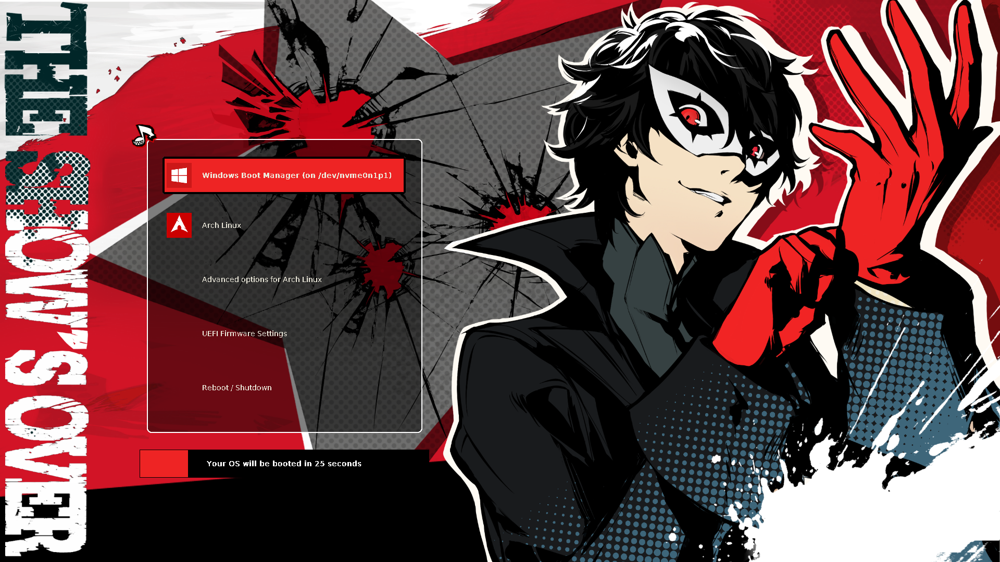

# Persona 5 Royal Grub Themes

This is a series of Persona 5 Royal themes for grub2, which contains 10 themes (10 main characters).

My work is just designed a boot menu to the original `All Out Attack` images.

If you feel these themes are good, it's not my credit, please thank the `P5R` team. :tada:

I referenced [StarRailGrubThemes](https://github.com/voidlhf/StarRailGrubThemes) & [starfield](https://github.com/endlessm/grub/tree/master/themes/starfield). Their work motivated me to make these themes.



# Installation

You can install the themes by `scripts`, `grub-customizer` or `manually`.

> It's easiest to install by `scripts`, but you need to download all the files.

The `tar.gz` files are also published in the `release` page.

## I. Install by scripts :thumbsup:

Just run `install.py` and choose the theme you want to install.

> :warning:Note: `sudo` is required so that the script can `copy` files to `/boot/grub/themes`, and it can `edit` `/etc/default/grub` to set the theme.

```bash
sudo python install.py
```

## II. Install by grub-customizer

Just download the `tar.gz` file and import it in grub-customizer.

`Appearance settings` -> `theme` -> `+` -> `choose your tar.gz file`

> Note: It's recommended to put your themes in `/boot/grub/themes`.

## III. Install manually

1. Download the `tar.gz` file from `release` page.
2. `Extract` it.
3. Copy the folder to `/boot/grub/themes`.
4. Edit `/etc/default/grub` and set `GRUB_THEME` to `/boot/grub/themes/<your-theme>/theme.txt`.
5. Update grub by `sudo update-grub` or `sudo grub-mkconfig -o /boot/grub/grub.cfg` (depends on your distro).

# Images Source

1. All Out Attack Images:
    - https://www.reddit.com/r/Persona5/comments/fxqgmf/p5r_clean_all_out_attack_finisher_images_ripped/
    - https://imgur.com/gallery/1mtkoBr

2. icons:
    - https://www.reddit.com/r/linux/comments/nt1tm9/i_made_a_uniform_icon_set_of_linux_distribution/

> The color of icons were changed by a program written by myself which adjusts the `hue` so that they are in "red" style.

If you are the owner of the images and you don't want to use them in this project, please [:mailbox_with_mail:contact me](mailto:SiriusLLLUUU@outlook.com) and I will remove them as soon as possible. 
